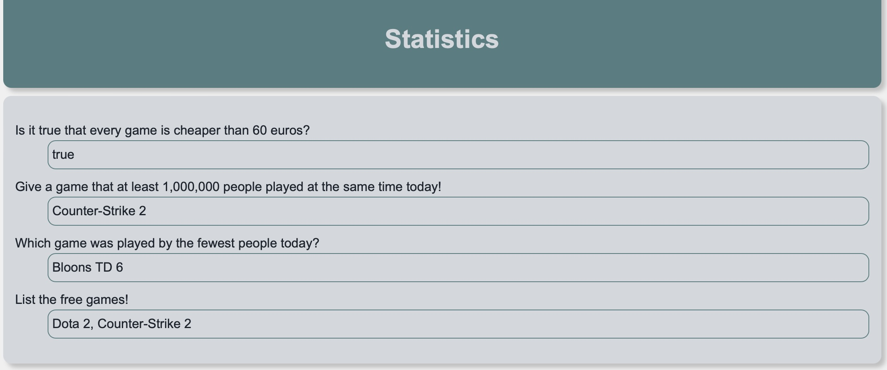

# Javascript Group Test

Today, the world's largest digital game platform hired us to solve the open tickets/projects with the help of our most qualified programmers, which the agile scrum masters selected from the backlog.

Our task is to create statistics about popular games.

- **a)** 2 point(s): Is it true that every game is cheaper than 60 euros? (`price`)
- **b)** 2 point(s): Give a game (`name`) that was played by at least 1,000,000 people at the same time today! (`peak`)
- **c)** 3 point(s): Which game (`name`) was played by the fewest people today? (`peak`)
- **d)** 3 point(s): List the free games! (`name`, `price: 0`)

Mark the tasks you solved:
- [ ] a.
- [ ] b.
- [ ] c.
- [ ] d.